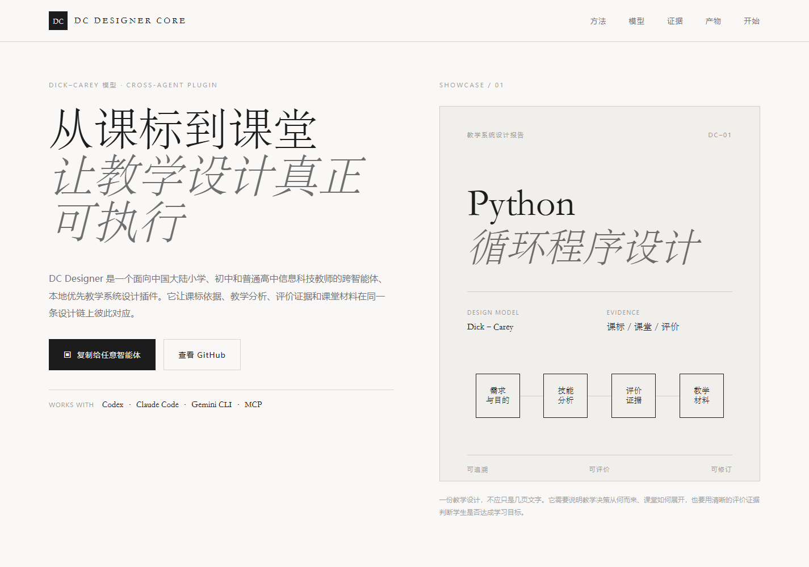
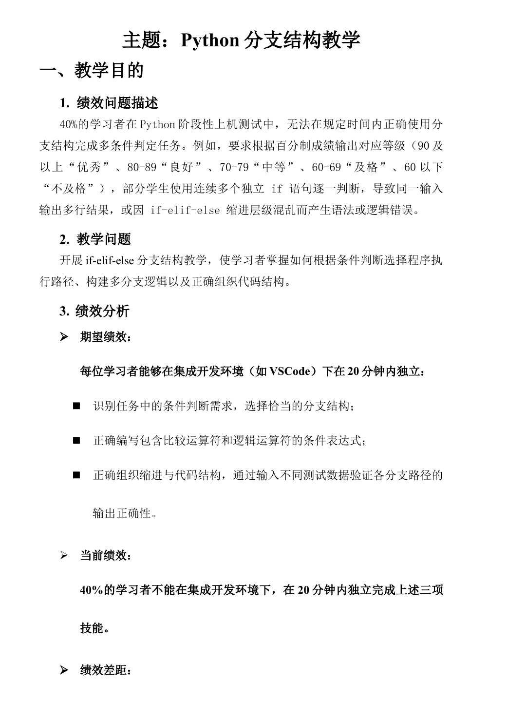
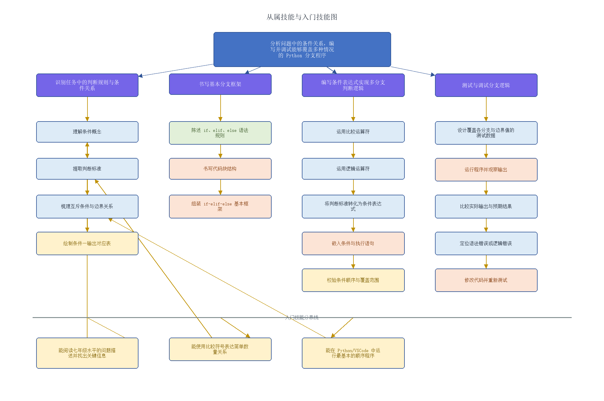
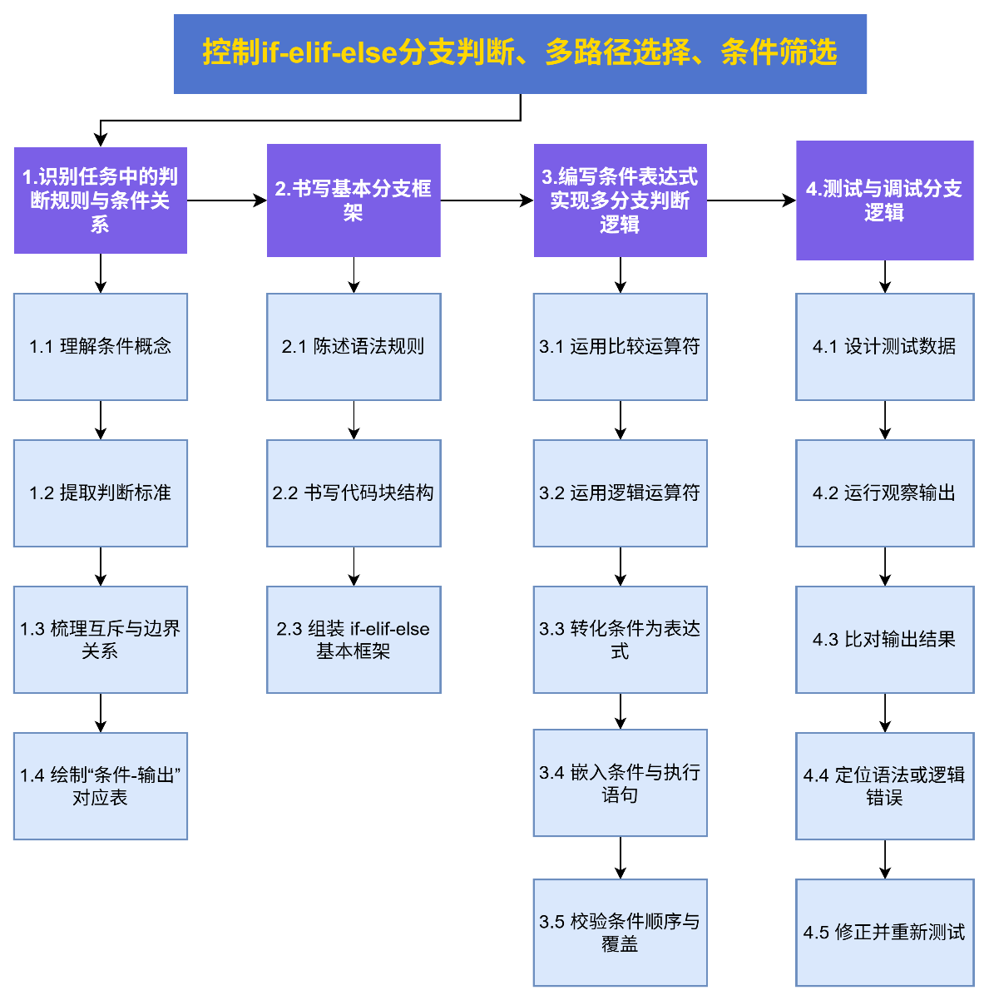
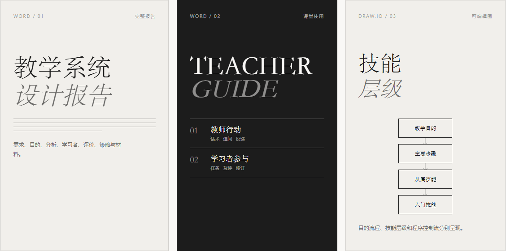
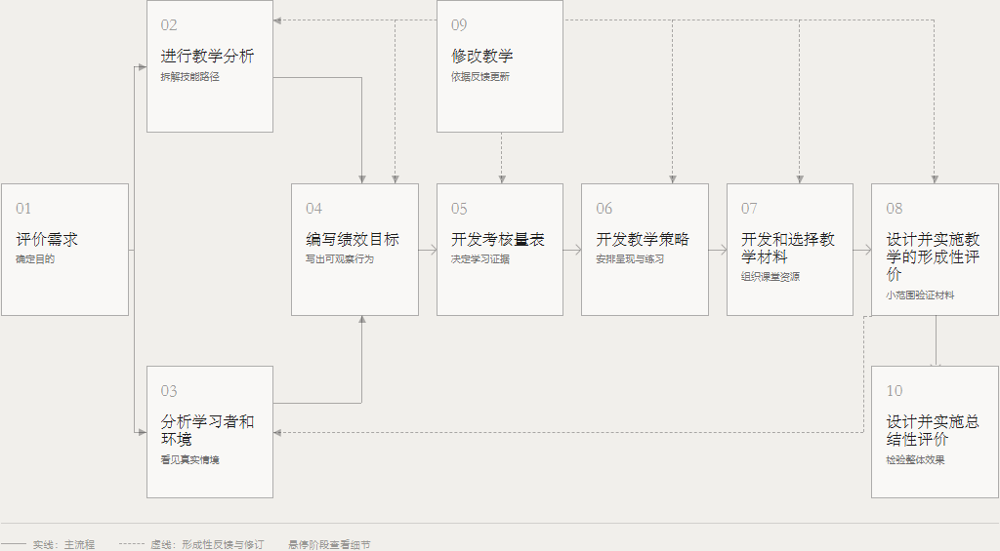
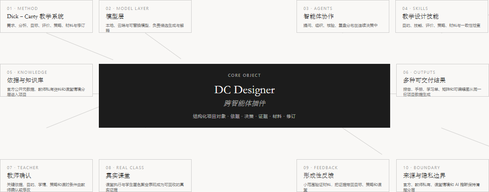
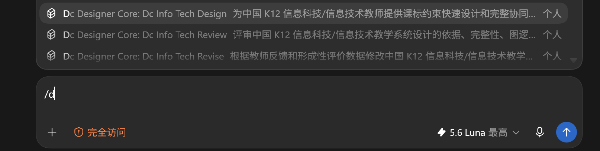
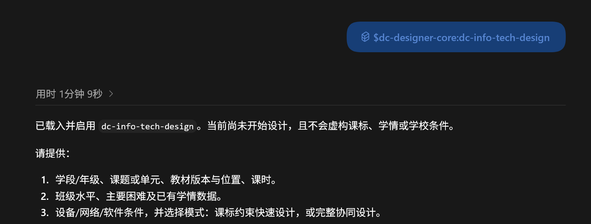
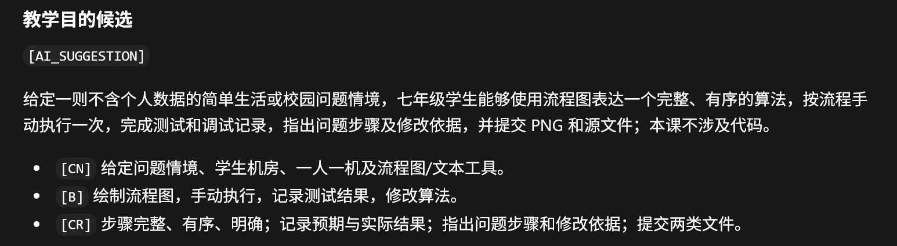

<div align="center">
  
  <h1>DC Designer</h1>
  <p><strong>从课标到课堂，让教学设计真正可执行。</strong></p>
  <p>Evidence-grounded Dick–Carey instructional design for nine China K–12 subjects.</p>
  <p>
    <a href="https://xiajiadi.github.io/dc-designer-core/">产品官网</a>
    ·
    <a href="docs/quickstart.md">快速开始</a>
    ·
    <a href="docs/source_provenance.md">来源与证据</a>
  </p>
  <p>
    <a href="https://github.com/xiajiadi/dc-designer-core/actions/workflows/ci.yml"></a>
    <a href="https://github.com/xiajiadi/dc-designer-core/actions/workflows/pages.yml"></a>
    <a href="LICENSE"></a>
  </p>
</div>

DC Designer v3.0 是一个面向中国大陆小学、初中和普通高中九学科教师的跨智能体、本地优先教学系统设计插件。支持语文、数学、英语、物理、化学、生物、历史、地理和政治。它以 Dick–Carey 教学系统设计模型为骨架，把课程标准、教学分析、学习者与环境、绩效目标、评价证据、教学策略、课堂材料和修订组织成一条可追溯的设计链。Codex、Claude Code、Gemini CLI、支持 MCP 的智能体，以及能够读取项目文件的其他智能体，都可以接入同一套核心能力。

它不是替教师一键生成教案，而是帮助教师完成一次有依据、有结构、有证据、可以进入课堂的教学系统设计。

## Why DC Designer

真正困难的不是写出一段教学文字，而是解释并检查这些关系：

- 教学目的为什么这样确定，依据哪一条课程标准；
- 学习者需要哪些入门技能，目标对应哪些可观察行为；
- 评价任务能否证明学习者已经达成目标；
- 教学策略、教学材料和评价证据是否保持一致；
- 教学实施后，应该根据什么证据继续修订。

DC Designer 将这些决策放回同一个教学系统中处理。

| 设计问题 | DC Designer 的处理方式 |
| --- | --- |
| 教学模型 | Dick–Carey 系统化设计流程 |
| 课程标准 | 官方来源元数据、条款候选和适用范围可追溯 |
| 教师判断 | 关键决策由教师确认、修改或补充 |
| 教学目标 | 条件、行为和标准对应的绩效目标 |
| 评价与策略 | 目标、评价、策略和材料的一致性检查 |
| 教师资料 | 本机优先，标记为 `C1/teacher_private` |
| 教学效果 | 没有真实数据时保持“待实施 / 待验证” |

## Sample Artifacts

下面的截图取自《Python 分支结构教学系统设计报告》，用于展示插件生成的交付物形态；它是信息科技示例，不代表产品只支持信息科技。报告中的课堂情境与评价数据仅作示例，不代表真实学生效果。截图展示的是交付物，不绑定某一个智能体宿主。

<table>
  <tr>
    <td align="center"></td>
    <td align="center"></td>
    <td align="center"></td>
  </tr>
  <tr>
    <td align="center"><sub>Python 分支结构教学系统设计报告</sub></td>
    <td align="center"><sub>技能目标与从属技能概览</sub></td>
    <td align="center"><sub>从属技能与入门技能图</sub></td>
  </tr>
</table>

## One Project, Many Deliverables

一次设计从同一个结构化项目对象生成多种可交付结果，编号、依据和链接保持一致：

- Word 完整教学系统设计报告、教师指南和学生学习单；
- Excel 目标—评价—策略一致性矩阵；
- JSON 项目文件、Markdown 证据和质量报告；
- 目的操作流程图、从属技能与入门技能图；
- 编程课题的开始、动作、决策、分支和测试 / 调试反馈图；
- PNG 图像、可编辑 Draw.io 单页图和多页工作簿。

<p align="center">
  
</p>

## The Design Chain

<p align="center">
  
</p>

设计从评价需求和绩效差距开始，经过教学分析、学习者与环境、绩效目标、评价工具、教学策略和材料，最后通过形成性评价与修订回到前面的决策。教学目的操作流程、技能层级和编程控制流程分别表达，不混合为一张含义不清的图。

## Product Architecture

<p align="center">
  
</p>

插件把教学模型、来源与知识库、教师确认、技能和评价规则、质量门禁以及多种输出组织成一个项目对象。它提供分析建议，但不替教师确认教学目的，也不把候选证据伪装成最终依据。

## Two Design Modes

### `standard_fast`

课标约束快速设计。适合已经明确课题、教材、课时和教学条件的教师。提供学段、年级、课题、教材位置、课时、设备和匿名班级共性学情后，系统检索课程标准依据，形成完整草案，再邀请教师确认关键决策。

### `collaborative`

完整协同设计。从评价需求和绩效差距开始，按 Dick–Carey 模型逐阶段执行：

`提问 → 候选与理由 → 教师确认或修改 → 保存决策 → 下一阶段`

适合课程设计、公开课、教学研究和需要完整设计证据的场景。

## Three Agent Skills

```text
/dc-designer-core:dc-info-tech-design
/dc-designer-core:dc-info-tech-review
/dc-designer-core:dc-info-tech-revise
```

- **Design**：创建九学科教学系统设计；
- **Review**：检查目标、评价、策略、来源和结构一致性；
- **Revise**：结合教师反馈和匿名形成性评价信息修订已有设计。

三条 Skill 是跨宿主共享的核心流程。不同智能体使用各自的原生入口或 MCP 接入方式，但读取的流程规则、项目合同和隐私边界保持一致。完整的宿主接入说明见 [跨智能体接入](docs/agent-compatibility.md)。

## Real Plugin Walkthrough

下面的三张截图来自一次真实的智能体桌面会话，展示从选择 Skill、提交课题，到生成教学目的候选的关键状态。当前公开素材以 Codex 桌面会话为例，但产品能力不限定于 Codex。由于设计流程需要等待检索并保留教师确认，公开展示采用关键截图序列，不用加速或伪造 GIF；截图中的课题为匿名演示输入，也不代表已经通过全部质量门禁。

<table>
  <tr>
    <td align="center"></td>
    <td align="center"></td>
    <td align="center"></td>
  </tr>
  <tr>
    <td align="center"><sub>01 · 选择 DC Designer Skill</sub></td>
    <td align="center"><sub>02 · 插件列出必需确认项</sub></td>
    <td align="center"><sub>03 · 生成教学目的候选</sub></td>
  </tr>
</table>

## Quick Start

当前版本面向 Windows 10 / 11，并需要 Python 3.10 或更高版本。完整环境检查和首次设计流程见 [Quick Start](docs/quickstart.md)。

### 原生入口

根据你正在使用的智能体选择对应入口。详细说明、权限边界和通用回退方式见 [跨智能体接入](docs/agent-compatibility.md)。

| 智能体 | 项目级接入方式 | 开始设计 |
| --- | --- | --- |
| Codex | 从当前仓库的 `.codex-plugin/` 识别插件 | `/dc-designer-core:dc-info-tech-design`（兼容命令名，按学科选择 v3） |
| Claude Code | 在仓库根目录运行 `claude --plugin-dir .` | `/dc-designer-core:dc-info-tech-design`（兼容命令名，按学科选择 v3） |
| Gemini CLI | 安装仓库中的 `gemini-extension.json` | `/dc-info-tech-design`（兼容命令名，按学科选择 v3） |
| 其他智能体 | 使用仓库内的 MCP、Skill 或通用提示词 | 粘贴 [`prompts/dc-designer-core.md`](prompts/dc-designer-core.md) |

官网“复制给任意智能体”按钮复制的是通用启动提示词，不是假设某个宿主已经安装完成的命令。将它粘贴到目标智能体后，智能体会先判断可用接入方式，再按当前项目权限完成接入检查。

Codex 示例：

```text
/dc-designer-core:dc-info-tech-design
```

也可以直接描述课题，例如：

```text
为初中数学《一次函数》做一次课标约束快速设计。
```

Claude Code 示例：

```text
claude --plugin-dir .
/dc-designer-core:dc-info-tech-design
```

Gemini CLI 示例：

```text
gemini extensions install https://github.com/xiajiadi/dc-designer-core
/dc-info-tech-design
```

产品介绍页可以独立本地预览：

```powershell
python -m http.server 4173 --directory site
```

然后打开 `http://127.0.0.1:4173/`。插件接入、教师资料导入和设计命令请参阅 [Quick Start](docs/quickstart.md)。

## Privacy & Trust

- 内置库只保存官方文件元数据、公开链接和标注为 `normalized_summary` 的条款候选，不复制受限全文；
- 教师上传的教材、教案、试卷和校本资料只写入本机 `.dc-designer/knowledge/`，并标记为 `C1/teacher_private`；
- 教师必须确认教学目的、入门技能、学情、课时设备、策略和正式依据等关键决策；
- 系统拒绝保存学生姓名、学号、身份证号、电话和个人成绩等身份信息；
- 没有真实形成性评价数据时，输出保持“待实施 / 待验证”，不编造教学效果。

## Scope

当前公开核心能力专注于：

- 中国大陆小学、初中和普通高中；
- 语文、数学、英语、物理、化学、生物、历史、地理和政治九个学科；
- `standard_fast` 课标约束快速设计与 `collaborative` 完整协同设计。

高校、职业教育、企业培训和九学科之外的学科不在当前范围内，系统会明确返回不支持，不会套用泛化模板继续生成。跨智能体支持改变的是接入方式，不改变教学范围、证据规则和教师确认边界。历史信息科技 v1 项目仍可通过 `education_scope=k12_info_technology` 继续使用。

## Documentation

- [快速开始](docs/quickstart.md)
- [跨智能体接入](docs/agent-compatibility.md)
- [来源与证据追溯](docs/source_provenance.md)
- [v3 项目设计](DESIGN.md)
- [v3.0.0 发布说明](docs/release_notes_v3.0.0.md)
- [历史 v1 信息科技合同](docs/v1_plugin_contract.md)
- [发布说明](docs/release_notes_v1.1.5.md)
- [变更记录](CHANGELOG.md)
- [贡献指南](CONTRIBUTING.md)
- [安全与隐私报告](SECURITY.md)
- [软件引用](CITATION.cff)

## Project Structure

```text
.codex-plugin/       Codex 原生适配清单
.claude-plugin/      Claude Code 原生适配清单
gemini-extension.json Gemini CLI 扩展清单
GEMINI.md            Gemini CLI 项目上下文
commands/            Gemini CLI 命令入口
prompts/             跨智能体通用启动提示词
skills/              Design、Review、Revise 三个共享 Skill
scripts/             通用 v3 入口、历史 v1 入口和导出工具
mcp-server/          MCP 兼容入口与教学设计核心
data/standards/      官方来源元数据和条款候选
schemas/             v3 项目与历史 v1 技能图合同
examples/            可复用的匿名请求与项目样例
site/                产品官网静态页面
docs/                用户、证据和发布文档
tests/               核心回归与验收测试
```

<details>
<summary>开发验证</summary>

核心开发验证命令如下。官网或文案迭代时，优先进行本地页面预览和受影响资源检查；跨智能体入口变更时，先运行适配清单检查；涉及核心插件或发布包时再执行完整门禁。

```text
python -m pytest -q
python scripts/compatibility_check.py
python scripts/release_check.py
python scripts/package_release.py
```

</details>

## License

MIT License. See [LICENSE](LICENSE).
